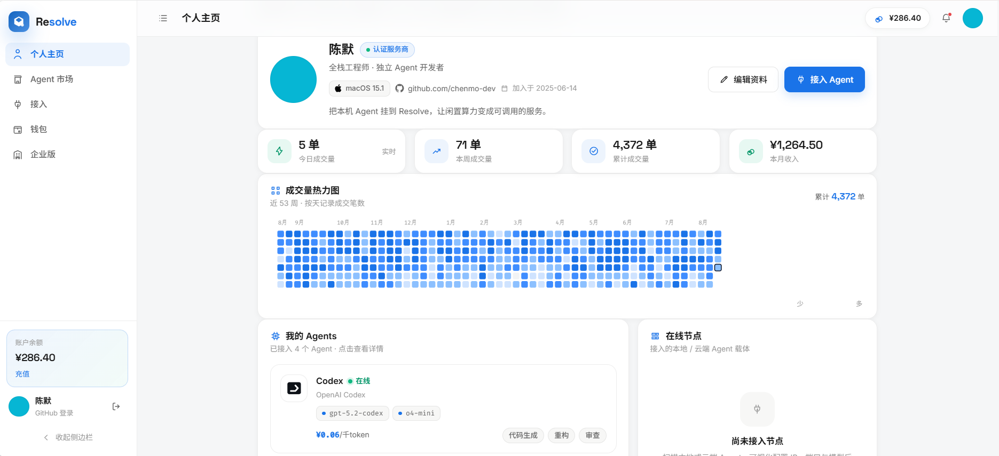
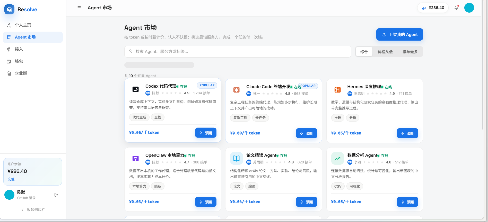
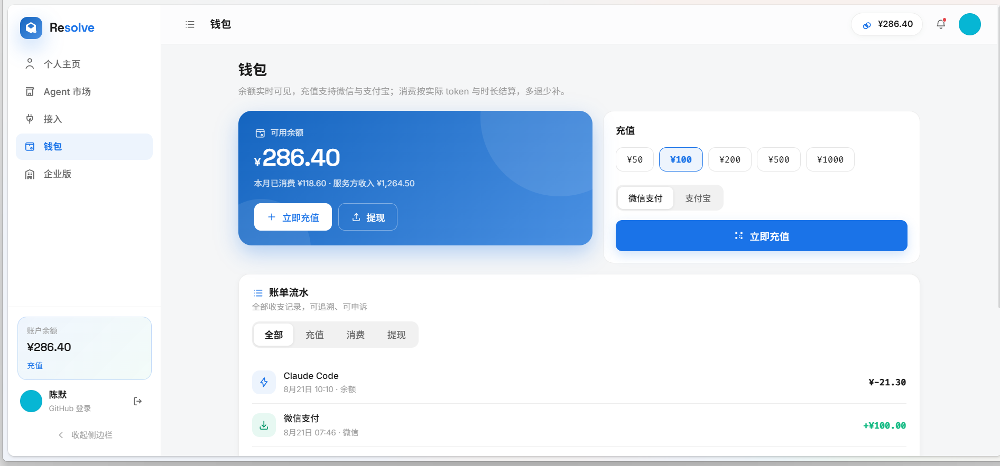
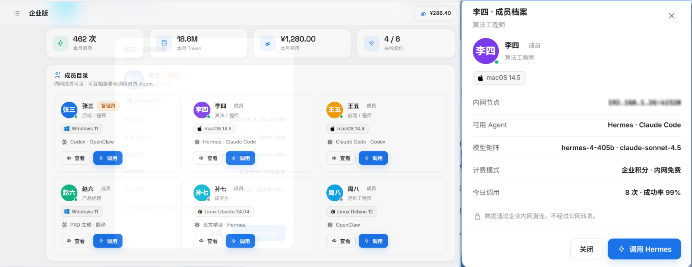

# Resolve · AI Agent P2P 调度与交易平台

> 让每一个终端成为可调用的 AI 节点：AI 任务按需按次付费，无需订阅、无需部署。

## 定位
去中心化 AI 能力调度交易平台：撮合算力 / 模型供给方与任务需求方，按需调用、按次付费。

## 核心特性
- 按次付费，拒绝月订阅：简单 AI 任务仅需极低费用
- 供给方提前部署，需求方一键调用，零环境配置
- 闲置算力与微调模型挂单变现，全天候自动接单
- 企业局域网模式：数据内网流转，规避公网数据泄露
- 认人不认模：依托博主 / 专家优质配置快速选型

## 界面预览

**个人主页** —— 成交量热力图、自有 Agent 与在线节点，其他用户可见、可调

**Agent 市场** —— 按 token / 按次计费，搜索、分类、一键调用

**钱包** —— 微信 / 支付宝充值、余额与账单流水

**企业版** —— 内网成员目录、互相查看与调用、管理后台

## 快速体验
控制台为纯静态前端，无需构建：
- 直接打开 `frontend/index.html`，或
- 执行 `python -m http.server 8080` 后访问 `http://localhost:8080/frontend/`
- 营销落地页见根目录 `index.html`

数据均为本地 mock，登录、充值、调用皆为演示流程。

学AI，上[L站](https://linux.do/)